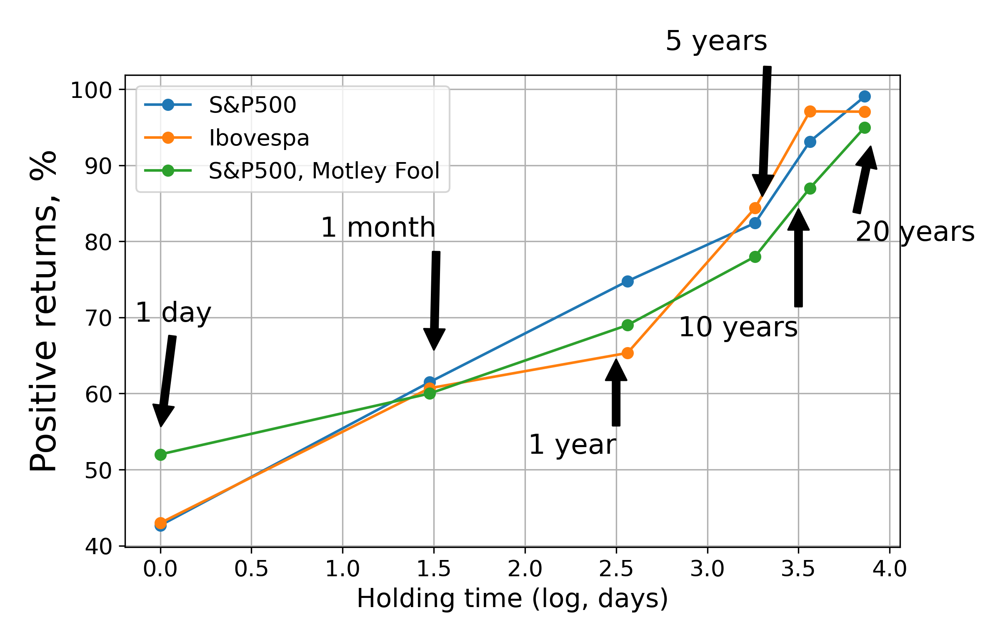

The longer you hold your stocks, the bigger the returns 
============================

What is the relation between "holding time" and positive returns in the stock market?

I wanted to reproduce the [following plot](https://g.foolcdn.com/misc-assets/hold%20stocks%20longer%20graph.png) made by the Motley Fool analysts:

 
Copyright: Motley Fool.

This plot basically explains why Warren Buffett is so rich. Because he is _old_. Of course, he is also damn smart. But let's not downplay the fact that he only became billionaire when he was 55 years old. And he bought his first stock when he was 11 years old (!!). 

Also, as I am Brazilian, I wanted to see whether the same pattern seen in S&P500 holds for [Ibovespa](https://en.wikipedia.org/wiki/Índice_Bovespa). I decided to tackle this using S&P500 and Ibovespa data with Python. 

# Results

Here are my results, plotted in a slightly different form than Motley Fool:

 
Positive returns from S&P500 (since 1950) and Ibovespa (since 1993).

# Conclusions

- The longer you hold your stocks, the more likely you will get positive returns. Patience is the key.
- My data is biased towards higher returns compared to Motley Fool's analysis, because my data has a shorter coverage.
- Ibovespa positive returns follow closely those of S&P500, even with vastly different data coverage.

For more information and the code, please refer to the jupyter notebook `positive returns.ipynb`.